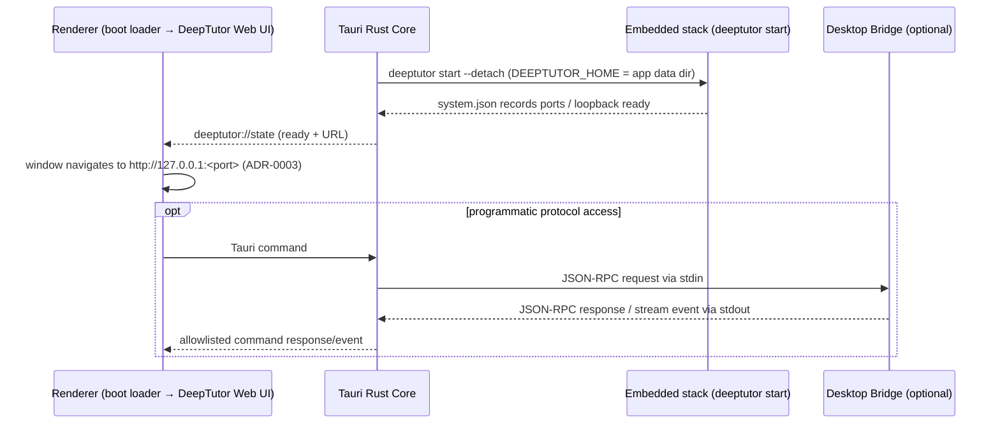

# DeepTutorDesktop Architecture

## 1. Scope

This project is a desktop distribution layer; it does not copy or modify DeepTutor's agent source code. DeepTutor is consumed as an external, versioned dependency and packaged into the final application at build time.

This project is explicitly not responsible for:

- rewriting DeepTutor's tools, capabilities, or provider implementations;
- binding DeepTutor's internal Python modules directly inside Tauri/Rust;
- exposing the agent to other local programs or external networks (the embedded web stack binds to the loopback interface only, per ADR-0003);
- writing user configuration, memory, or knowledge bases into the application install directory.

## 2. Layers

### 2.1 Tauri Desktop Shell

The Tauri Rust Core is responsible for:

- creating the window and managing its lifecycle;
- starting, monitoring, and terminating the embedded DeepTutor full stack (`deeptutor start --detach`, probing readiness and navigating the window to the loopback frontend URL, stopping gracefully on exit);
- starting, monitoring, and terminating the stdio bridge child process (programmatic protocol access);
- exposing a minimal set of Tauri commands/events to the WebView renderer;
- managing application paths, and seeding `interface.json` from the OS language/theme on first launch;
- forwarding the bridge's structured events to the renderer.

The Tauri Rust Core must not call DeepTutor's internal Python implementation.

### 2.2 Renderer / Frontend

The renderer owns interface and interaction; it never touches Python, the file system, or child processes directly.

The frontend uses a transport abstraction:

```text
Transport
├── WebTransport       # future browser/web deployment
└── TauriTransport     # Desktop IPC
```

The desktop build reaches the agent only through the API allowlisted via Tauri commands.

### 2.3 Desktop Bridge

The bridge is a standalone Python package/executable sidecar responsible for:

- reading JSON-RPC requests from stdin;
- calling DeepTutor's public SDK or stable entry points;
- writing results, streaming events, and errors to stdout;
- handling cancellation, timeouts, and graceful exit;
- never listening on TCP ports.

The bridge is not an internal module of the DeepTutor agent source tree. It uses DeepTutor exclusively through versioned dependencies.

### 2.4 Current DeepTutor entry points

DeepTutor today provides a Python SDK, a CLI, and an HTTP/WebSocket API, but no native stdio JSON-RPC server. The bridge's job is to translate the desktop protocol onto DeepTutor's public entries:

```text
Desktop JSON-RPC
        ↓
Desktop Bridge
        ↓
DeepTutorApp / TurnRequest / stream_turn
```

The `DeepTutorApp` Python SDK is preferred because it is an in-process async facade with direct access to turns, sessions, and streaming events. `deeptutor run --format json` works as a simple one-shot or diagnostic fallback, but it emits an NDJSON stream that is not equivalent to this project's JSON-RPC protocol. The complete web UI is served over loopback HTTP by the embedded stack (ADR-0003); the stdio bridge serves protocol-level, TCP-free programmatic access.

### 2.5 Agent Runtime

The agent runtime consists of:

- a standalone Python runtime (python-build-standalone);
- a pinned `deeptutor` wheel (including the `deeptutor_web` frontend build);
- an official Node.js binary (required by the Next.js standalone server);
- runtime resources and optional dependencies DeepTutor needs.

The runtime is a build input of the desktop application and is never committed to Git.

## 3. Process and data flow



## 4. Security boundary

- The embedded web stack binds only to the loopback address (`127.0.0.1`) and is never exposed externally; this is ADR-0003's formal amendment of the original "no TCP" constraint, while the stdio bridge remains zero-TCP.
- The WebView renderer calls only explicitly registered Tauri commands/events.
- Tauri capabilities authorize only the fixed sidecar, arguments, and resources — no arbitrary shell.
- The bridge's stdin/stdout carries NDJSON; logs go to stderr and never pollute the protocol stream.
- The user data directory is separate from the application resources directory.
- All external-file, command, and provider-configuration capabilities inherit DeepTutor's own security policy.

## 5. Versioning policy

Desktop builds must pin the agent version; they never track DeepTutor's `main` branch directly.

Recommended record:

```text
agent_package: deeptutor
agent_version: <pinned version>
bridge_protocol: 1
runtime_target: darwin-arm64 | darwin-x64 | win32-x64 | linux-x64
artifact_sha256: <release artifact hash>
```

The bridge protocol and the agent package are versioned independently. Changes to the agent's internal modules never become Desktop APIs directly.

## 6. Future evolution

The complete interface runs on the embedded loopback web stack (ADR-0003); programmatic access runs over stdio JSON-RPC (ADR-0001). Alternative transports such as Unix domain sockets or named pipes will only be considered when performance or multi-platform reuse genuinely requires them.
