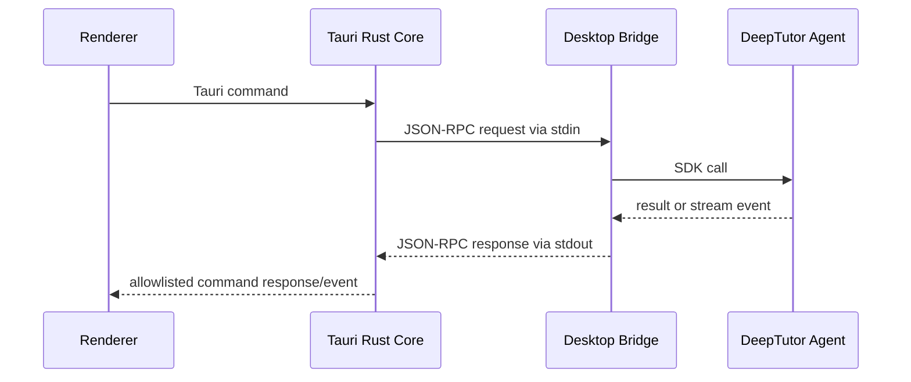

# DeepTutor Desktop 架构

## 1. 范围

本项目是桌面分发层，不复制或修改 DeepTutor agent 的业务源码。DeepTutor 作为外部版本化依赖，由桌面应用在构建阶段打包进最终应用。

本项目不承担以下职责：

- 重写 DeepTutor 的 tools、capabilities 或 provider 实现；
- 在 Tauri/Rust 中直接绑定 DeepTutor 的内部 Python 模块；
- 让 agent 通过 TCP 端口暴露给本机其他程序；
- 把用户配置、记忆、知识库写入应用安装目录。

## 2. 分层

### 2.1 Tauri Desktop Shell

Tauri Rust Core 负责：

- 创建窗口和管理生命周期；
- 启动、监控和终止 bridge 子进程；
- 为 WebView Renderer 暴露最小化的 Tauri commands/events；
- 管理应用级路径、版本和更新；
- 将 bridge 的结构化事件转发给 Renderer。

Tauri Rust Core 不应调用 DeepTutor 的 Python 内部实现。

### 2.2 Renderer / Frontend

Renderer 负责界面和交互，不直接访问 Python、文件系统或子进程。

前端使用抽象 transport：

```text
Transport
├── WebTransport       # 未来的浏览器/Web 部署
└── TauriTransport     # Desktop IPC
```

桌面版通过 Tauri command allowlist 暴露的白名单 API 调用 agent。

### 2.3 Desktop Bridge

Bridge 是独立的 Python package/可执行 sidecar，负责：

- 从 stdin 读取 JSON-RPC 请求；
- 调用 DeepTutor 的公开 SDK 或稳定入口；
- 将结果、流式事件和错误写入 stdout；
- 处理取消、超时和优雅退出；
- 不监听 TCP 端口。

Bridge 不属于 DeepTutor agent 源码仓库的内部模块。它只通过版本化依赖使用 DeepTutor。

### 2.4 DeepTutor 当前入口

DeepTutor 当前提供 Python SDK、CLI 和 HTTP/WebSocket API，但没有原生的 stdio JSON-RPC server。Bridge 的职责就是把桌面协议转换为 DeepTutor 的公开入口：

```text
Desktop JSON-RPC
        ↓
Desktop Bridge
        ↓
DeepTutorApp / TurnRequest / stream_turn
```

优先使用 `DeepTutorApp` Python SDK，因为它是进程内 async facade，可以直接访问 turn、session 和流式事件。`deeptutor run --format json` 可作为简单的一次性或诊断 fallback，但它输出的是 NDJSON stream，不等同于本项目的 JSON-RPC 协议。HTTP/WebSocket API 暂不作为桌面版 transport，因为桌面版的目标是不监听 TCP 端口。

### 2.5 Agent Runtime

Agent runtime 由以下内容组成：

- 独立 Python runtime；
- 固定版本的 `deeptutor` wheel；
- Bridge package；
- DeepTutor 所需的运行时资源和可选依赖。

Runtime 是桌面应用的构建输入，不提交到 Git 仓库。

## 3. 进程和数据流



## 4. 安全边界

- Agent 不绑定 `127.0.0.1`、`0.0.0.0` 或其他 TCP 地址。
- WebView Renderer 只调用明确注册的 Tauri commands/events。
- Tauri capabilities 只授权固定的 sidecar、参数和资源，不开放任意 shell。
- Bridge 的 stdin/stdout 使用 NDJSON；日志写入 stderr，不污染协议流。
- 用户数据目录与应用资源目录分离。
- 所有外部文件、命令和 provider 配置能力继承 DeepTutor 自身的安全策略。

## 5. 版本策略

桌面构建必须固定 agent 版本，不直接依赖 DeepTutor 的 `main` 分支。

建议记录：

```text
agent_package: deeptutor
agent_version: <pinned version>
bridge_protocol: 1
runtime_target: darwin-arm64 | darwin-x64 | win32-x64 | linux-x64
artifact_sha256: <release artifact hash>
```

Bridge 协议和 agent package 版本分别管理。agent 的内部模块变更不能直接成为 Desktop 的 API。

## 6. 后续演进

第一阶段使用 stdio JSON-RPC。只有在协议稳定、性能或多端复用确实需要时，才考虑 Unix Domain Socket、named pipe 或远程 HTTP/WebSocket。
